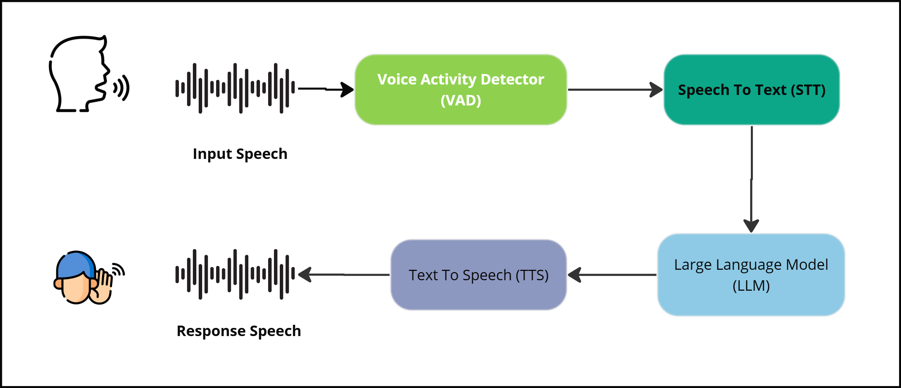

# Speech-to-Speech Chatbot

This project is a real-time speech-to-speech chatbot that enables seamless voice-based interactions. It utilizes **Automatic Speech Recognition (ASR), Voice Activity Detection (VAD), a Large Language Model (LLM), and Text-to-Speech (TTS)** for a complete conversational experience.


## 🚀 Features
- **Speech-to-Text (STT)**: Converts spoken input to text using `nvidia/parakeet-tdt_ctc-110m`.
- **Voice Activity Detection (VAD)**: Identifies speech segments using `snakers4/silero-vad`.
- **Natural Language Processing (NLP)**: Processes input and generates responses using `qwen2.5-0.5B`.[Any model can be used]
- **Text-to-Speech (TTS)**: Converts responses back to speech using `kokoro`.
- **Real-time Client-Server Communication**: Uses **Flask** and **SocketIO** for handling requests.

## 📌 Installation

### 1️⃣ Clone the repository
```bash
git clone https://github.com/sazzad1779/SpeechToSpeechChatBot.git
cd SpeechToSpeechChatBot
```

### 2️⃣ Install dependencies
```bash
pip install -r requirements.txt
```

### 3️⃣ Run the server
```bash
python main.py
```

## 🔧 Configuration
- The project uses **Flask** as the backend and **SocketIO** for real-time communication.
- Users interact via **voice**, and responses are provided **audibly**.
- Model dependencies will be downloaded automatically.

## 🛠 Tech Stack
- **Backend**: Flask, Python
- **STT Model**: `nvidia/parakeet-tdt_ctc-110m`
- **VAD Model**: `snakers4/silero-vad`
- **LLM**: `qwen2.5-0.5B`
- **TTS Model**: `kokoro`
- **Real-time Communication**: Flask-SocketIO

## 🏗 Future Improvements
- Multi-language support
- Enhanced response latency optimization
- Web-based frontend for easy access

## 📜 License
This project is licensed under **MIT License**.
